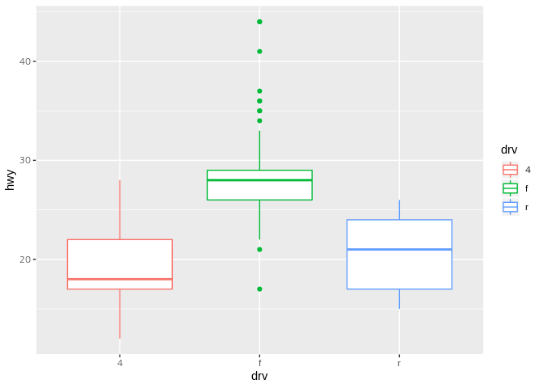

Untitled
================

## GitHub Documents

This is an R Markdown format used for publishing markdown documents to
GitHub. When you click the **Knit** button all R code chunks are run and
a markdown file (.md) suitable for publishing to GitHub is generated.

## Including Code

You can include R code in the document as follows:

``` r
summary(cars)
```

    ##      speed           dist       
    ##  Min.   : 4.0   Min.   :  2.00  
    ##  1st Qu.:12.0   1st Qu.: 26.00  
    ##  Median :15.0   Median : 36.00  
    ##  Mean   :15.4   Mean   : 42.98  
    ##  3rd Qu.:19.0   3rd Qu.: 56.00  
    ##  Max.   :25.0   Max.   :120.00

## Including Plots

You can also embed plots, for example:

<!-- -->

``` r
library(ggplot2)
mpg
```

    ## # A tibble: 234 x 11
    ##    manufacturer model    displ  year   cyl trans   drv     cty   hwy fl   
    ##    <chr>        <chr>    <dbl> <int> <int> <chr>   <chr> <int> <int> <chr>
    ##  1 audi         a4        1.80  1999     4 auto(l… f        18    29 p    
    ##  2 audi         a4        1.80  1999     4 manual… f        21    29 p    
    ##  3 audi         a4        2.00  2008     4 manual… f        20    31 p    
    ##  4 audi         a4        2.00  2008     4 auto(a… f        21    30 p    
    ##  5 audi         a4        2.80  1999     6 auto(l… f        16    26 p    
    ##  6 audi         a4        2.80  1999     6 manual… f        18    26 p    
    ##  7 audi         a4        3.10  2008     6 auto(a… f        18    27 p    
    ##  8 audi         a4 quat…  1.80  1999     4 manual… 4        18    26 p    
    ##  9 audi         a4 quat…  1.80  1999     4 auto(l… 4        16    25 p    
    ## 10 audi         a4 quat…  2.00  2008     4 manual… 4        20    28 p    
    ## # ... with 224 more rows, and 1 more variable: class <chr>

``` r
qplot(drv, hwy, data = mpg, geom="boxplot", color=drv)
```

<!-- -->

Note that the `echo = FALSE` parameter was added to the code chunk to
prevent printing of the R code that generated the plot.
